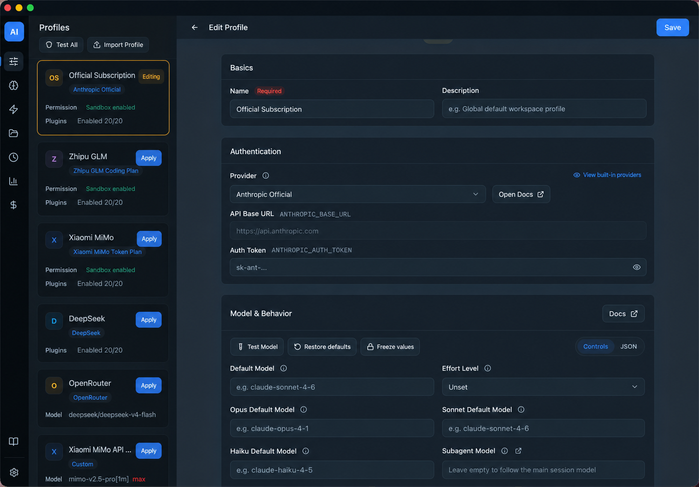
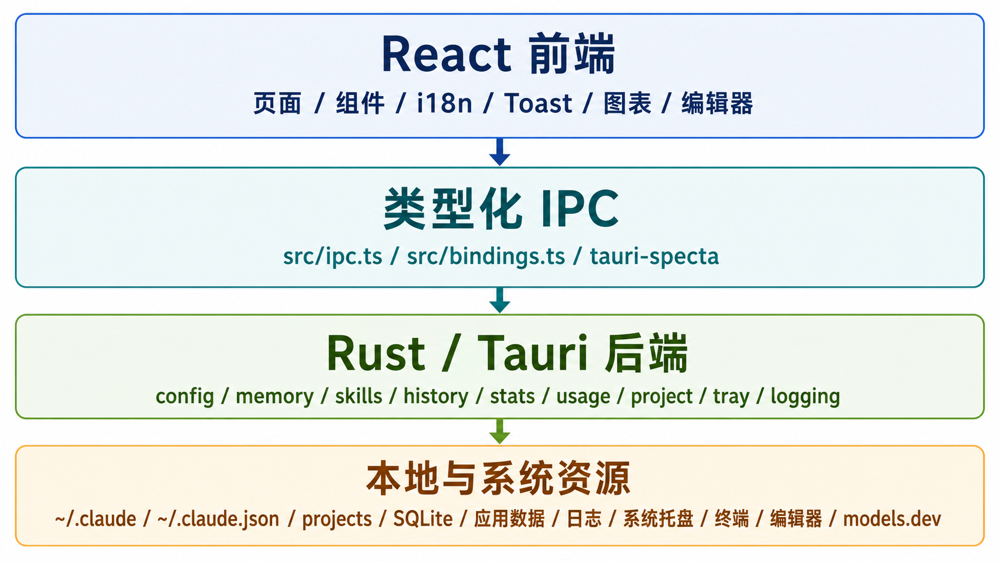

# Code Manager

[English](./README.md) | [中文](./README.zh-CN.md)

[](https://github.com/maguowei/code-manager/actions/workflows/ci.yml)
[](https://github.com/maguowei/code-manager/actions/workflows/release.yml)



Code Manager is a local desktop management app for Claude Code users. It brings profiles, providers, the `~/.claude` directory, memories, Skills, history, stats, token usage, project status, the system tray, and diagnostic logs together in a single Tauri 2 app, making your local configuration more visible, previewable, and verifiable.

This document is for human users and project visitors. Execution rules for AI agents are in [CLAUDE.md](./CLAUDE.md), the full usage guide is in [docs/user-manual.md](./docs/user-manual.md), and platform differences are in [docs/platform-support.md](./docs/platform-support.md).

## The Problem It Solves

Over long-term use of Claude Code, local configuration and session data tend to scatter across many files:

- Different projects need different models, API endpoints, tokens, permissions, hooks, and plugin combinations.
- `~/.claude/settings.json`, `CLAUDE.md`, `rules/*.md`, and Skills are hard to review as a whole.
- Provider / model configuration is repetitive, and switching profiles easily misses environment variables or overrides user settings.
- History, stats, token spend, project Git status, and worktree information lack a single entry point.
- Troubleshooting requires quickly viewing redacted application logs instead of hunting for log files everywhere.

Code Manager does not replace Claude Code; it provides a management layer for local configuration, session data, and diagnostic information.

## Core Capabilities


| Capability | Description |
| --- | --- |
| `~/.claude` Overview | Browse, preview, edit, and locate the Claude Code user directory. |
| Profiles / Built-in Providers | Manage the profile layer that is ultimately written to `~/.claude/settings.json`, pick connection endpoints and model mappings from built-in (read-only) providers, with support for models, environment variables, permissions, Sandbox, hooks, plugins, status line, preview, copy, model testing, one-click apply, import an existing settings file, export (optionally with secrets, with a pre-save preview), diff comparison, and one-click sync of common options / marketplaces / plugins to other profiles. |
| Memory Management | Manage user-level `CLAUDE.md` and `rules/*.md`, with support for the Karpathy behavior guide preset, import, enable, disable, copy, preview, and path validation. |
| Skills Management | Create, edit, delete, enable, and disable Claude Code Skills, and sync them as `~/.codex/skills/<id>` symlinks. |
| History & Sessions | Read `~/.claude/history.jsonl` and view history details by project and session. |
| Stats & Recent Sessions | Read a local stats snapshot from `~/.claude.json`. |
| Token Usage & Cost | Scan `~/.claude/projects/**/*.jsonl`, aggregate tokens and cost by date, project, session, and model, with incremental SQLite caching. |
| Project Management | Show project paths, remotes, branches, worktrees, project-level `.claude/`, `AGENTS.md` / `CLAUDE.md`, and `.agents/skills` status, with support for opening a terminal/editor, jumping to history/usage, branch and worktree cleanup, and clearing local project data. |
| System Tray & Session Focus | Show the current profile and active Claude Code sessions in the menu bar, with session-count styles and a pending-session breathing indicator, attempt to focus existing terminal sessions on supported platforms, and (macOS only) mirror session state to ANTICATER USB device LED effects. |
| Desktop Usage Widget | An always-on-top, translucent mini-window that shows today's token spend, usage, and cache-hit metrics in real time, with drag support, customizable metrics, and adjustable opacity, toggleable in settings. |
| Settings & Diagnostics | Support language, theme, default-collapsed sidebar, menu-bar session display, system notifications, third-party model pricing, launch at login, default terminal and editor, session-focus shortcut and LED effects (macOS only), desktop usage widget toggle and metric customization, redacted log viewing, system info copy, and log rotation. |

## Download and Install

On macOS, installing via Homebrew (own tap) is recommended:

```bash
brew install --cask maguowei/tap/code-manager
```

Or go to [Releases](https://github.com/maguowei/code-manager/releases) to download the installer for your platform.

| Platform | Installer |
| --- | --- |
| macOS (Apple Silicon / Intel) | `.dmg` (or `brew install --cask maguowei/tap/code-manager`) |
| Windows | `.msi` / `.exe` |
| Linux | `.deb` / `.rpm` / `.AppImage` |

The current macOS release packages are not notarized by Apple. Homebrew installs automatically remove the quarantine attribute; if you manually download the `.dmg` and the first launch is blocked by the system, run the following in a terminal:

```bash
xattr -rd com.apple.quarantine /Applications/code-manager.app
```

### Automatic Updates

The app has built-in automatic updates: it silently checks for new versions on startup, and once one is found you can download and install it with one click in "Settings - App Update", after which it restarts automatically. Users who installed via Homebrew can also keep upgrading with `brew upgrade`; both paths work, and after an in-app update the version Homebrew records will automatically align on the next `brew upgrade`.

## Quick Start

1. After launch, Code Manager reads your local `~/.claude`, `~/.claude.json`, and `~/.claude/projects/`.
2. In settings, choose the interface language, theme, default terminal, and default editor.
3. On the profiles page, import an existing `~/.claude/settings.json`, or create a new profile, pick a built-in provider in the "Provider" option, and fill in the auth secret and model configuration.
4. Click "Test Model" to confirm the configuration works.
5. Click enable to apply the profile to `~/.claude/settings.json`.
6. Go to the `~/.claude` overview to confirm the final configuration is as expected.

For more detailed page descriptions, cost accounting rules, common workflows, and FAQ, see [docs/user-manual.md](./docs/user-manual.md).

## Local Data and Privacy

Code Manager mainly reads and writes local files. Profile merging, directory scanning, usage aggregation, and log viewing all happen locally; model pricing prefers the local cache and built-in fallback data, and attempts to refresh from official models.dev providers after startup.

| Purpose | macOS | Linux | Windows |
| --- | --- | --- | --- |
| Application data | `~/.config/code-manager/` | `$XDG_CONFIG_HOME/code-manager/` or `~/.config/code-manager/` | `%APPDATA%\code-manager\` |
| Usage SQLite | `~/Library/Application Support/com.gotobeta.app.code-manager/usage.db` | `$XDG_CONFIG_HOME/com.gotobeta.app.code-manager/usage.db` or `~/.config/com.gotobeta.app.code-manager/usage.db` | `%APPDATA%\com.gotobeta.app.code-manager\usage.db` |
| Log directory | `~/Library/Logs/com.gotobeta.app.code-manager/` | `$XDG_DATA_HOME/com.gotobeta.app.code-manager/logs/` or `~/.local/share/com.gotobeta.app.code-manager/logs/` | `%LOCALAPPDATA%\com.gotobeta.app.code-manager\logs\` |

The application data directory contains `config-registry.json`, `memories.json`, `model-pricing.json`, and `skills-disabled/`. On macOS, application data deliberately uses `~/.config/code-manager/` for easier cross-platform backup and script access; SQLite uses Tauri's `app_config_dir()`, and logs use the Tauri plugin's default path.

## Local Development

Stack overview: Tauri 2 + React 19 + TypeScript + Vite + Tailwind CSS v4 + Rust. For full agent execution rules, verification notes, and fine-grained path navigation, see [CLAUDE.md](./CLAUDE.md).



### Prerequisites

- Node.js LTS
- `pnpm`, the project currently declares `pnpm@11.2.2`
- Rust stable
- The system dependencies required to run Tauri 2

### Common Commands

```bash
make init             # Install dependencies and check the Rust toolchain
make dev              # Start Tauri desktop dev mode
make build            # Build the installer for the current platform
make build-frontend   # TypeScript check and build the frontend
make bindings         # Regenerate Tauri IPC TypeScript bindings
make bindings-check   # Check that Rust command contracts and src/bindings.ts are in sync
make lint             # Frontend Biome + Rust clippy
make test             # Rust tests + frontend tests
make check            # Rust cargo check
make fmt-check        # Read-only format check for frontend + Rust
make verify           # Local CI-like verification entry point
make gitleaks         # Scan current project files for secrets
make gitleaks-history # Scan Git history for secrets
make lint-frontend    # Read-only static check for the frontend
make test-frontend    # Run frontend tests
```

`pnpm install` triggers the `prepare` script and installs lefthook git hooks. Before a commit it runs staged Biome auto-fix, Gitleaks secret scanning, Rust format check, and commitlint; before a branch push it runs `make verify`; tag-only pushes are gated remotely by the release workflow's quality job. `make fmt` and `pnpm check` rewrite files; for read-only checks use `make lint`, `make lint-frontend`, or `make fmt-check`.

Build artifacts are located by default in `src-tauri/target/release/bundle/`.

### Repository at a Glance

| Path | Purpose |
| --- | --- |
| `src/` | React frontend pages, components, hooks, schemas, and tests. |
| `src/components/` | Page-level components and reusable UI; finer component entry points are in `CLAUDE.md`. |
| `src-tauri/src/` | Rust backend, Tauri commands, and local file and data capabilities. |
| `src-tauri/resources/` | Built-in providers, model pricing, status line scripts, and other resources. |
| `src-tauri/capabilities/` | Tauri permission declarations. |
| `docs/` | User manual, platform differences, and extended documentation. |
| `.claude/rules/` | Path-scoped maintenance rules for AI agents. |

## Contributing and Feedback

When filing an issue, please include as much as possible:

- Operating system, Code Manager version, and Claude Code use case
- Reproduction steps, expected result, and actual result
- Relevant redacted log snippets from "Settings -> Diagnostics -> View Logs"
- For development changes, the verification commands you have run

## Further Reading

- [docs/user-manual.md](./docs/user-manual.md): the complete user manual
- [docs/platform-support.md](./docs/platform-support.md): platform support differences
- [docs/claude-code-best-practices.md](./docs/claude-code-best-practices.md): extended best practices for Claude Code / Codex in this repo
- [CLAUDE.md](./CLAUDE.md): the repository execution manual for AI agents
- [LICENSE](./LICENSE): license

## License

MIT
