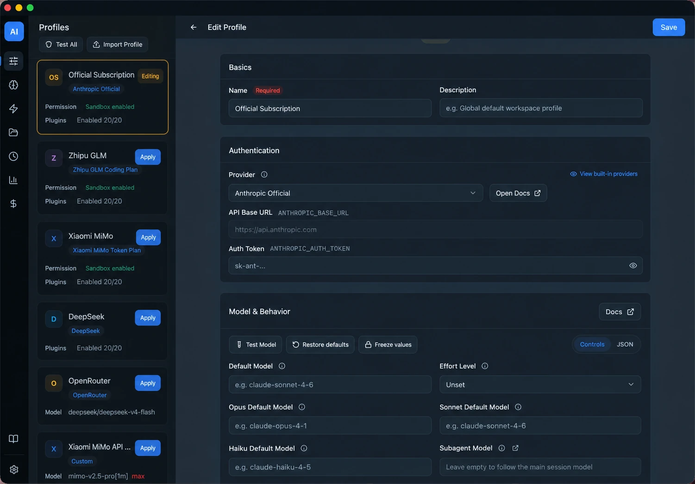
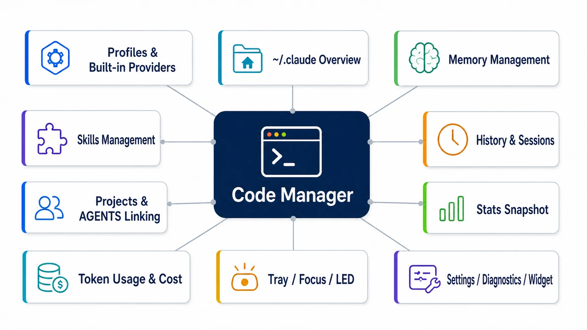
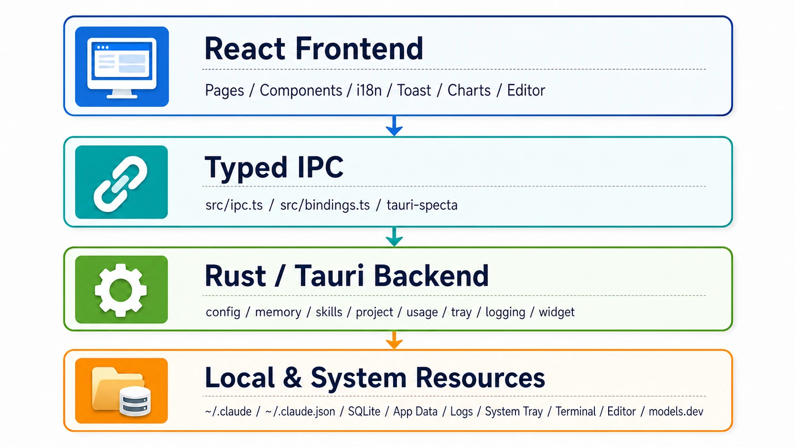

# Code Manager

[English](./README.md) | [中文](./README.zh-CN.md)

[](https://github.com/maguowei/code-manager/actions/workflows/ci.yml)
[](https://github.com/maguowei/code-manager/actions/workflows/release.yml)
[](./LICENSE)



**Code Manager** is a cross-platform desktop management application for Claude Code users, built with Tauri 2. It unifies your profiles, providers, `~/.claude` directory, memories, Skills, session history, token usage, project status, system tray, and diagnostic logs into a single interface — making local configuration visible, previewable, and verifiable.

> [!NOTE]
> This document is for human users and project visitors. AI agent execution rules live in [CLAUDE.md](./CLAUDE.md), full usage documentation is in [docs/user-manual.md](./docs/user-manual.md), and platform differences are documented in [docs/platform-support.md](./docs/platform-support.md).

## The Problem It Solves

As you use Claude Code across different projects, configuration and session data quickly scatter across various local files:

- **Fragmented settings**: Different projects require distinct models, API endpoints, tokens, permissions, hooks, and plugins.
- **Hidden state**: `~/.claude/settings.json`, `CLAUDE.md`, `rules/*.md`, and Skills are difficult to inspect as a whole.
- **Configuration friction**: Switching providers or models is repetitive, with the risk of missing environment variables or accidentally overwriting user settings.
- **Scattered telemetry**: Session history, token expenditure, project Git status, and worktrees lack a unified entry point.
- **Cumbersome troubleshooting**: Resolving issues often requires hunting down system log files rather than inspecting structured, sanitized logs.

Code Manager does not replace Claude Code; it provides a dedicated control plane for managing local configurations, session data, and diagnostics.

## Core Capabilities



| Capability | Description |
| --- | --- |
| **`~/.claude` Overview** | Browse, preview, edit, and quickly locate files in the Claude Code user directory. |
| **Profiles & Providers** | Manage configuration layers written to `~/.claude/settings.json`. Select connection endpoints and model mappings from built-in (read-only) providers. Visually edit models, environment variables, permissions, Sandbox, hooks, plugins, and the status line. Supports connectivity testing, pre-apply diffs, secret-safe import/export, and one-click sync across profiles. |
| **Memory Management** | Manage user-level `CLAUDE.md` and `rules/*.md` files with path validation. Includes Karpathy behavior guide presets, toggle switches (enable/disable), previewing, and cloning. |
| **Skills Management** | Create, edit, toggle, and organize Claude Code Skills, with automatic symlink syncing to `~/.codex/skills/<id>`. |
| **History & Sessions** | Parse `~/.claude/history.jsonl` to explore session timelines, prompts, and summaries filtered by project. |
| **Stats & Insights** | Read local activity snapshots from `~/.claude.json` to monitor usage trends and recent sessions. |
| **Token Usage & Cost** | Scan `~/.claude/projects/**/*.jsonl` with an incremental SQLite engine. Aggregate token counts and costs by date, project, session, and model. |
| **Project Workspace** | Track Git branches, remotes, worktrees, project-level `.claude/`, rules (`AGENTS.md` / `CLAUDE.md`), and skills. Quickly launch a terminal or code editor. |
| **System Tray & Focus** | Monitor active sessions from the system menu bar with pending-session breathing indicators, jump to active terminals via shortcuts, and mirror session state to ANTICATER USB LEDs (macOS only). |
| **Desktop Usage Widget** | An always-on-top, translucent mini-window displaying today's token spend, usage, and cache-hit metrics in real time, with drag support and customizable metrics. |
| **Settings & Diagnostics** | Customize theme, language, default terminal/editor, model pricing overrides, and launch-at-login. Built-in log viewer with automatic secret redaction and one-click system info export. |

## Download and Install

On macOS, installing via Homebrew is recommended:

```bash
brew install --cask maguowei/tap/code-manager
```

Alternatively, download the installer for your platform from [Releases](https://github.com/maguowei/code-manager/releases):

| Platform | Installer |
| --- | --- |
| macOS (Apple Silicon / Intel) | `.dmg` (or `brew install --cask maguowei/tap/code-manager`) |
| Windows | `.msi` / `.exe` |
| Linux | `.deb` / `.rpm` / `.AppImage` |

> [!TIP]
> Current macOS releases are not notarized by Apple. Homebrew installations automatically clear quarantine attributes. If you manually download the `.dmg` and the first launch is blocked by Gatekeeper, run:
> ```bash
> xattr -rd com.apple.quarantine /Applications/code-manager.app
> ```

### Nightly Builds

Want to test the latest features before an official release? Nightly builds for macOS (`.dmg`), Linux (`.deb` / `.AppImage`), and Windows (`setup.exe`) are generated on every merge to `main` and published at [releases/download/nightly](https://github.com/maguowei/code-manager/releases/download/nightly). Versions include the commit short SHA (e.g. `1.6.0-nightly.ga1b2c3d`) for precise tracking.

Nightly builds are **not signed or notarized**:
- **macOS**: Right-click → Open, or run `xattr -rd com.apple.quarantine /Applications/code-manager.app`.
- **Windows**: Windows SmartScreen may display an unrecognized app notice.
- **Updates**: Nightly releases roll forward on each merge and do **not** self-update. Install a stable release for automatic update support.

### Automatic Updates

The app includes built-in update checks on launch:
- When an update is detected, download and install with one click under **Settings → App Update**, followed by an automatic restart.
- Homebrew users can continue using `brew upgrade`; in-app updates automatically align with Homebrew on the next upgrade.

## Quick Start

1. **Auto-Discovery**: On launch, Code Manager reads your local `~/.claude`, `~/.claude.json`, and `~/.claude/projects/`.
2. **General Preferences**: In **Settings**, choose your preferred interface language, theme, default terminal, and editor.
3. **Configure Profile**: On the **Profiles** page, import an existing `~/.claude/settings.json` or create a new profile. Choose a built-in provider, then enter your API credentials and model configuration.
4. **Test Connectivity**: Click **Test Model** to verify API communication.
5. **Apply Configuration**: Click **Enable** to write the active profile safely into `~/.claude/settings.json`.
6. **Verify Overview**: Switch to the **`~/.claude` Overview** page to confirm the updated directory and configuration state.

For detailed page descriptions, cost calculation rules, common workflows, and FAQ, see [docs/user-manual.md](./docs/user-manual.md).

## Local Data and Privacy

Code Manager operates primarily on your local file system. Profile merging, directory scanning, token usage calculation, and log inspection run entirely offline on your machine. Model pricing prefers the local cache and built-in fallbacks, attempting to refresh from official models.dev providers after startup.

| Purpose | macOS | Linux | Windows |
| --- | --- | --- | --- |
| Application data | `~/.config/code-manager/` | `$XDG_CONFIG_HOME/code-manager/` or `~/.config/code-manager/` | `%APPDATA%\code-manager\` |
| Usage SQLite | `~/Library/Application Support/com.gotobeta.app.code-manager/usage.db` | `$XDG_CONFIG_HOME/com.gotobeta.app.code-manager/usage.db` or `~/.config/com.gotobeta.app.code-manager/usage.db` | `%APPDATA%\com.gotobeta.app.code-manager\usage.db` |
| Log directory | `~/Library/Logs/com.gotobeta.app.code-manager/` | `$XDG_DATA_HOME/com.gotobeta.app.code-manager/logs/` or `~/.local/share/com.gotobeta.app.code-manager/logs/` | `%LOCALAPPDATA%\com.gotobeta.app.code-manager\logs\` |

The application data directory contains `config-registry.json`, `memories.json`, `model-pricing.json`, and `skills-disabled/`. On macOS, application data deliberately uses `~/.config/code-manager/` for easier cross-platform backup and scripting access.

## Local Development

Stack overview: Tauri 2 + React 19 + TypeScript + Vite + Tailwind CSS v4 + Rust. For full agent execution rules, verification notes, and fine-grained path navigation, see [CLAUDE.md](./CLAUDE.md).



### Prerequisites

- Node.js LTS
- `pnpm` (the project currently declares `pnpm@12.4.2`)
- Rust stable
- System dependencies required to run Tauri 2

### Common Commands

```bash
# --- Development & Build ---
make init             # Install dependencies and verify Rust toolchain
make dev              # Start Tauri desktop dev mode
make build            # Build production installer for current platform
make build-frontend   # TypeScript check and build frontend

# --- Verification & Testing ---
make verify           # Comprehensive local verification (runs before push)
make lint             # Biome (frontend) + Clippy (Rust) static checks
make test             # Run all tests (Rust backend + frontend Vitest)
make check            # Quick Rust compiler check (cargo check)
make fmt-check        # Read-only formatting check (frontend + Rust)
make lint-frontend    # Frontend-only static check
make test-frontend    # Run frontend test suite

# --- Contracts & Security ---
make bindings         # Regenerate Tauri IPC TypeScript bindings
make bindings-check   # Verify Rust command signatures match src/bindings.ts
make gitleaks         # Scan working tree for secrets
make gitleaks-history # Scan Git history for secrets
```

`pnpm install` triggers the `prepare` script and installs lefthook git hooks. Before a commit it runs staged Biome auto-fix, Gitleaks secret scanning, Rust format check, and commitlint; before a branch push it runs `make verify`; tag-only pushes are gated remotely by the release workflow's quality job. `make fmt` and `pnpm check` rewrite files; for read-only checks use `make lint`, `make lint-frontend`, or `make fmt-check`.

Build artifacts are located by default in `src-tauri/target/release/bundle/`.

### Repository at a Glance

- `src/`: React frontend pages, components, hooks, schemas, and tests.
- `src-tauri/`: Rust backend, Tauri commands, built-in resources, and permission declarations.
- `docs/`: User manual, platform differences, and extended documentation.

For fine-grained component entry points, module responsibilities, and path navigation for AI agents, see [CLAUDE.md](./CLAUDE.md).

## Contributing and Feedback

When filing an issue, please include:

- Operating system, Code Manager version, and Claude Code use case
- Reproduction steps, expected result, and actual result
- Relevant redacted log snippets from **Settings → Diagnostics → View Logs**
- For development changes, verification commands you have run and test results

## Further Reading

- [docs/user-manual.md](./docs/user-manual.md): Comprehensive user manual
- [docs/platform-support.md](./docs/platform-support.md): Platform support differences
- [CLAUDE.md](./CLAUDE.md): Repository execution manual for AI agents
- [LICENSE](./LICENSE): MIT License

## License

MIT
