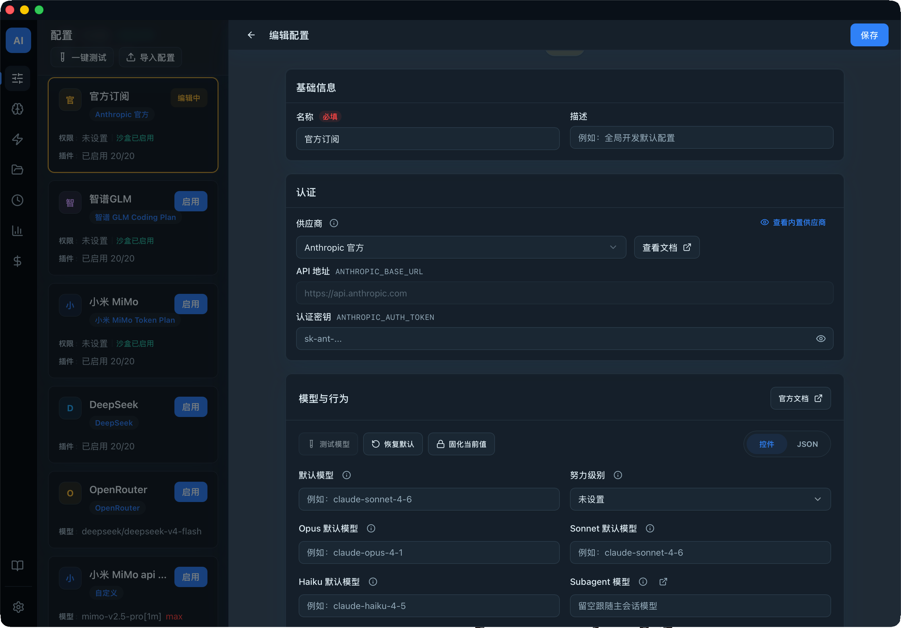
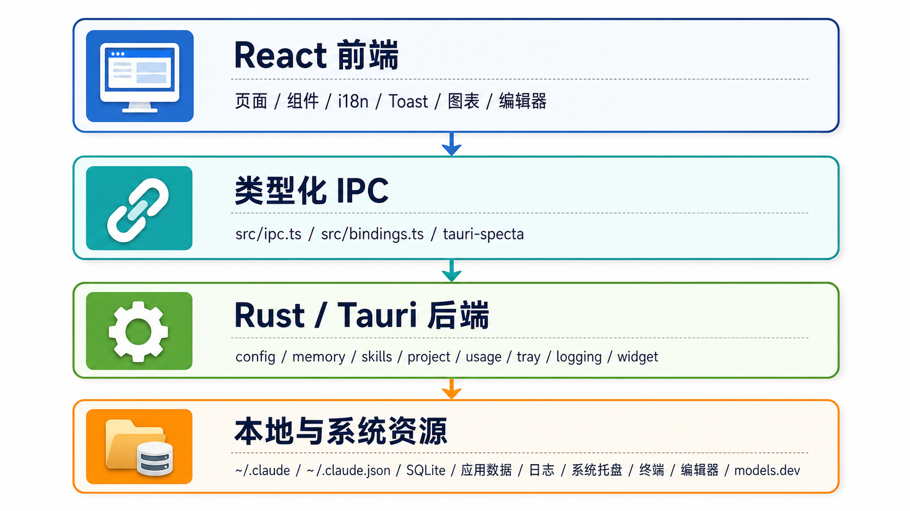

# Code Manager

[English](./README.md) | [中文](./README.zh-CN.md)

[](https://github.com/maguowei/code-manager/actions/workflows/ci.yml)
[](https://github.com/maguowei/code-manager/actions/workflows/release.yml)



Code Manager 是面向 Claude Code 用户的本地桌面管理应用。它把配置、供应商、`~/.claude` 目录、记忆、Skills、历史、统计、Token 用量、项目状态、系统托盘和诊断日志集中到一个 Tauri 2 应用里，让本地配置更可见、可预览、可验证。

本文件面向人类用户和项目访问者。AI Agent 的执行规则见 [CLAUDE.md](./CLAUDE.md)，完整使用说明见 [docs/user-manual.zh-CN.md](./docs/user-manual.zh-CN.md)，平台差异见 [docs/platform-support.zh-CN.md](./docs/platform-support.zh-CN.md)。

## 解决的问题

长期使用 Claude Code 时，本地配置和会话数据容易散落在多个文件里：

- 不同项目需要不同模型、API 地址、Token、权限、Hooks 和插件组合。
- `~/.claude/settings.json`、`CLAUDE.md`、`rules/*.md` 与 Skills 不容易整体检查。
- Provider / model 配置重复，切换配置时容易漏写环境变量或覆盖用户设置。
- 历史记录、统计、Token 花费、项目 Git 状态和 worktree 信息缺少统一入口。
- 排障时需要快速查看脱敏后的应用日志，而不是到处找日志文件。

Code Manager 不替代 Claude Code，而是提供一个本机配置、会话数据和诊断信息的管理层。

## 核心能力


| 能力 | 说明 |
| --- | --- |
| `~/.claude` 总览 | 浏览、预览、编辑和定位 Claude Code 用户目录。 |
| 配置 / 内置供应商 | 管理最终写入 `~/.claude/settings.json` 的配置层，从内置供应商(只读)选择连接地址与模型映射，支持模型、环境变量、权限、Sandbox、Hooks、插件、状态行、预览、复制、模型测试、一键应用、导入现有 settings、导出(可选含密钥、落盘前预览)、差异对比，以及一键把常用选项 / 市场 / 插件同步到其他配置。 |
| 记忆管理 | 管理用户级 `CLAUDE.md` 与 `rules/*.md`，支持 Karpathy 行为指南预设、导入、启用、禁用、复制、预览和路径校验。 |
| Skills 管理 | 新建、编辑、删除、启用、禁用 Claude Code Skills，并可同步为 `~/.codex/skills/<id>` 软链接。 |
| 历史与会话 | 读取 `~/.claude/history.jsonl`，按项目和会话查看历史详情。 |
| 统计与最近会话 | 从 `~/.claude.json` 读取本地统计快照。 |
| Token 用量与费用 | 扫描 `~/.claude/projects/**/*.jsonl`，按日期、项目、会话和模型聚合 Token 与费用，并使用 SQLite 增量缓存。 |
| 项目管理 | 展示项目路径、远程地址、分支、worktree、项目级 `.claude/`、`AGENTS.md` / `CLAUDE.md` 与 `.agents/skills` 状态，支持打开终端/编辑器、跳转历史/用量、分支与 worktree 清理和清理本地项目数据。 |
| 系统托盘与会话聚焦 | 菜单栏显示当前配置和 Claude Code 活跃会话，支持会话计数样式与待处理呼吸灯，在支持的平台尝试聚焦已有终端会话，并可（仅 macOS）把会话状态镜像到 ANTICATER USB 设备灯效。 |
| 桌面用量浮窗 | 置顶半透明小窗，实时展示今日 Token 花费、用量与缓存命中等指标，支持拖拽、自定义展示指标与不透明度，可在设置中开关。 |
| 设置与诊断 | 支持语言、主题、默认收起侧边栏、菜单栏会话显示、系统通知、第三方模型计价、登录启动、默认终端和编辑器、会话聚焦快捷键与 LED 灯效（仅 macOS）、桌面用量浮窗开关与指标自定义、脱敏日志查看、系统信息复制和日志轮转。 |

## 下载安装

macOS 推荐用 Homebrew 安装（自有 tap）：

```bash
brew install --cask maguowei/tap/code-manager
```

或前往 [Releases](https://github.com/maguowei/code-manager/releases) 下载对应平台的安装包。

| 平台 | 安装包 |
| --- | --- |
| macOS (Apple Silicon / Intel) | `.dmg`（或 `brew install --cask maguowei/tap/code-manager`） |
| Windows | `.msi` / `.exe` |
| Linux | `.deb` / `.rpm` / `.AppImage` |

macOS 当前发布包未经过 Apple 公证。Homebrew 安装会自动移除隔离属性；若手动下载 `.dmg` 后首次打开被系统拦截，可在终端执行：

```bash
xattr -rd com.apple.quarantine /Applications/code-manager.app
```

### 自动更新

应用内置自动更新：启动时会静默检查新版本，发现后在「设置 - 应用更新」中可一键下载并安装，安装完成后自动重启。通过 Homebrew 安装的用户也可继续用 `brew upgrade` 升级；两种方式都可用，应用内更新后 Homebrew 记录的版本号会在下次 `brew upgrade` 时自动对齐。

## 快速使用

1. 启动应用后，Code Manager 会读取本机 `~/.claude`、`~/.claude.json` 和 `~/.claude/projects/`。
2. 在设置中选择界面语言、主题、默认终端和默认编辑器。
3. 在配置页导入现有 `~/.claude/settings.json`，或新建配置，在「供应商」选项处选择内置供应商并填写认证密钥与模型配置。
4. 点击“测试模型”确认配置可用。
5. 点击启用，将配置应用到 `~/.claude/settings.json`。
6. 到 `~/.claude` 总览确认最终配置符合预期。

更完整的页面说明、费用统计口径、常见工作流和 FAQ 见 [docs/user-manual.zh-CN.md](./docs/user-manual.zh-CN.md)。

## 本地数据与隐私

Code Manager 主要读写本机文件。配置合并、目录扫描、用量聚合和日志查看都在本地完成；模型价格会优先使用本地缓存和内置兜底数据，并在启动后尝试从 models.dev 官方 provider 刷新。

| 用途 | macOS | Linux | Windows |
| --- | --- | --- | --- |
| 应用数据 | `~/.config/code-manager/` | `$XDG_CONFIG_HOME/code-manager/` 或 `~/.config/code-manager/` | `%APPDATA%\code-manager\` |
| 用量 SQLite | `~/Library/Application Support/com.gotobeta.app.code-manager/usage.db` | `$XDG_CONFIG_HOME/com.gotobeta.app.code-manager/usage.db` 或 `~/.config/com.gotobeta.app.code-manager/usage.db` | `%APPDATA%\com.gotobeta.app.code-manager\usage.db` |
| 日志目录 | `~/Library/Logs/com.gotobeta.app.code-manager/` | `$XDG_DATA_HOME/com.gotobeta.app.code-manager/logs/` 或 `~/.local/share/com.gotobeta.app.code-manager/logs/` | `%LOCALAPPDATA%\com.gotobeta.app.code-manager\logs\` |

应用数据目录包含 `config-registry.json`、`memories.json`、`model-pricing.json` 和 `skills-disabled/`。macOS 上应用数据刻意使用 `~/.config/code-manager/`，便于跨平台备份和脚本访问；SQLite 使用 Tauri `app_config_dir()`，日志使用 Tauri 插件默认路径。

## 本地开发

技术栈概览：Tauri 2 + React 19 + TypeScript + Vite + Tailwind CSS v4 + Rust。完整 Agent 执行规则、验证说明和细粒度路径导航见 [CLAUDE.md](./CLAUDE.md)。



### 前置要求

- Node.js LTS
- `pnpm`，项目当前声明 `pnpm@11.2.2`
- Rust stable
- 满足 Tauri 2 运行所需的系统依赖

### 常用命令

```bash
make init             # 安装依赖并检查 Rust 工具链
make dev              # 启动 Tauri 桌面开发模式
make build            # 构建当前平台安装包
make build-frontend   # TypeScript 检查并构建前端
make bindings         # 重新生成 Tauri IPC TypeScript bindings
make bindings-check   # 检查 Rust command 契约与 src/bindings.ts 是否同步
make lint             # 前端 Biome + Rust clippy
make test             # Rust 测试 + 前端测试
make check            # Rust cargo check
make fmt-check        # 前端 + Rust 只读格式检查
make verify           # 本地 CI-like 验证入口
make gitleaks         # 扫描当前项目文件中的密钥
make gitleaks-history # 扫描 Git 历史中的密钥
make lint-frontend    # 前端只读静态检查
make test-frontend    # 运行前端测试
```

`pnpm install` 会触发 `prepare` 脚本并安装 lefthook git hooks。提交前会运行 staged Biome 自动修复、Gitleaks 密钥扫描、Rust 格式检查与 commitlint，分支推送前会运行 `make verify`；tag-only push 由 release workflow 的 quality job 执行远端门禁。`make fmt` 与 `pnpm check` 会改写文件；只想做只读检查时使用 `make lint`、`make lint-frontend` 或 `make fmt-check`。

构建产物默认位于 `src-tauri/target/release/bundle/`。

### 仓库速览

| 路径 | 用途 |
| --- | --- |
| `src/` | React 前端页面、组件、hooks、schema 与测试。 |
| `src/components/` | 页面级组件和复用 UI；更细组件入口见 `CLAUDE.md`。 |
| `src-tauri/src/` | Rust 后端、Tauri command、本地文件与数据能力。 |
| `src-tauri/resources/` | 内置 provider、模型价格和状态行脚本等资源。 |
| `src-tauri/capabilities/` | Tauri 权限声明。 |
| `docs/` | 用户手册、平台差异和扩展文档。 |
| `.claude/rules/` | 面向 AI Agent 的 path-scoped 维护规则。 |

## 贡献与反馈

提交问题时，请尽量附上：

- 操作系统、Code Manager 版本和 Claude Code 使用场景
- 复现步骤、期望结果和实际结果
- “设置 -> 诊断 -> 查看日志”中相关的脱敏日志片段
- 如果是开发改动，请说明已运行的验证命令

## 进一步阅读

- [docs/user-manual.zh-CN.md](./docs/user-manual.zh-CN.md)：完整用户说明书
- [docs/platform-support.zh-CN.md](./docs/platform-support.zh-CN.md)：平台支持差异
- [docs/claude-code-best-practices.md](./docs/claude-code-best-practices.md)：Claude Code / Codex 在本仓库的扩展最佳实践
- [docs/claude-code/plugin-update.md](./docs/claude-code/plugin-update.md)：Claude Code 插件更新方式
- [CLAUDE.md](./CLAUDE.md)：面向 AI Agent 的仓库执行手册
- [LICENSE](./LICENSE)：许可证

## License

MIT
