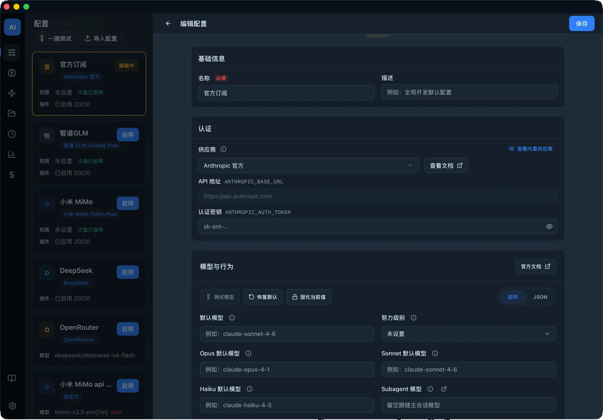
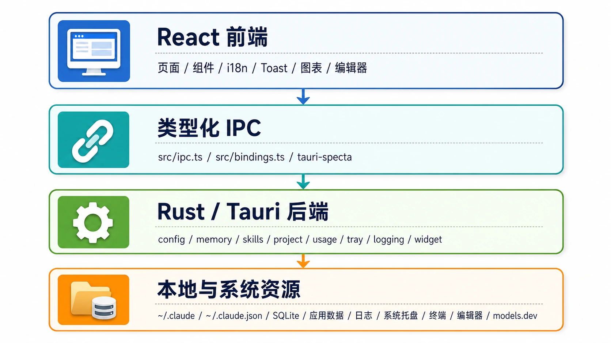

# Code Manager

[English](./README.md) | [中文](./README.zh-CN.md)

[](https://github.com/maguowei/code-manager/actions/workflows/ci.yml)
[](https://github.com/maguowei/code-manager/actions/workflows/release.yml)
[](./LICENSE)



**Code Manager** 是面向 Claude Code 用户的跨平台本地桌面管理应用，基于 Tauri 2 构建。它将配置、供应商、`~/.claude` 目录、记忆、Skills、会话历史、Token 用量、项目状态、系统托盘和诊断日志集中到统一界面中，让本地配置更可见、可预览、可验证。

> [!NOTE]
> 本文件面向人类用户和项目访问者。AI Agent 的执行规则见 [CLAUDE.md](./CLAUDE.md)，完整使用说明见 [docs/user-manual.zh-CN.md](./docs/user-manual.zh-CN.md)，平台差异见 [docs/platform-support.zh-CN.md](./docs/platform-support.zh-CN.md)。

## 解决的问题

在长期与多项目中使用 Claude Code 时，本地配置和会话数据容易散落在多个文件中：

- **配置碎片化**：不同项目往往需要不同的模型、API 地址、Token、权限、Hooks 和插件组合。
- **状态不透明**：`~/.claude/settings.json`、`CLAUDE.md`、`rules/*.md` 与 Skills 缺乏全局审查视角。
- **配置摩擦大**：切换 Provider 或模型操作繁琐，容易漏填环境变量或意外覆盖已有配置。
- **数据无聚合**：历史记录、统计数据、Token 花费、项目 Git 状态与 worktree 信息缺少统一看板。
- **排障路径长**：遇到问题时需要四处定位系统日志文件，难以快速获取已脱敏的应用诊断信息。

Code Manager 并不替代 Claude Code，而是为其提供一个专注本地配置、会话数据与诊断信息的管控层。

## 核心能力


| 能力 | 说明 |
| --- | --- |
| **`~/.claude` 总览** | 集中浏览、预览、编辑与快速定位 Claude Code 用户目录下的关键文件。 |
| **配置 / 内置供应商** | 管理最终写入 `~/.claude/settings.json` 的配置层。从内置供应商（只读）快速选择连接地址与模型映射；可视化配置模型、环境变量、权限、Sandbox、Hooks、插件与状态行；支持连通性测试、落盘前 Diff 对比、安全导入/导出（密钥脱敏可选）以及跨 Profile 一键同步。 |
| **记忆管理** | 集中管理用户级 `CLAUDE.md` 与 `rules/*.md` 文件并执行路径校验；内置 Karpathy 行为指南预设，支持一键启用/禁用、复制与实时预览。 |
| **Skills 管理** | 创建、编辑、删除、启用与禁用 Claude Code Skills，并自动同步为 `~/.codex/skills/<id>` 软链接。 |
| **历史与会话** | 解析 `~/.claude/history.jsonl`，按项目与会话维度探索会话时间线、输入提示与历史详情。 |
| **统计与概览** | 从 `~/.claude.json` 读取本地统计快照，跟踪会话活跃度与最近会话。 |
| **Token 用量与费用** | 基于 SQLite 增量扫描 `~/.claude/projects/**/*.jsonl`，按日期、项目、会话与模型多维度聚合 Token 用量与成本支出。 |
| **项目管理** | 跟踪项目路径、Git 远程分支、worktree、项目级 `.claude/`、规则（`AGENTS.md` / `CLAUDE.md`）与 Skills 状态；支持一键唤起终端或编辑器。 |
| **系统托盘与终端聚焦** | 在菜单栏实时展示当前活跃会话与待处理呼吸灯；支持通过快捷键尝试聚焦已有终端会话，并可将状态镜像至 ANTICATER USB 硬件灯效（仅 macOS）。 |
| **桌面用量浮窗** | 置顶半透明桌面小窗，实时展示今日 Token 花费、用量与缓存命中率；支持拖拽吸附与展示指标自定义。 |
| **设置与诊断** | 支持界面语言、主题风格、默认终端/编辑器、模型自定义计价与开机自启；内置日志查看器（自动脱敏密钥）并支持一键导出系统诊断信息。 |

## 下载安装

macOS 推荐使用 Homebrew 安装（自有 tap）：

```bash
brew install --cask maguowei/tap/code-manager
```

或前往 [Releases](https://github.com/maguowei/code-manager/releases) 下载对应平台的安装包：

| 平台 | 安装包 |
| --- | --- |
| macOS（Apple Silicon / Intel） | `.dmg`（或使用 Homebrew 安装） |
| Windows | `.msi` / `.exe` |
| Linux | `.deb` / `.rpm` / `.AppImage` |

> [!TIP]
> macOS 当前发布包未经过 Apple 公证。Homebrew 安装会自动移除隔离属性；若手动下载 `.dmg` 后首次打开被 Gatekeeper 拦截，可在终端执行：
> ```bash
> xattr -rd com.apple.quarantine /Applications/code-manager.app
> ```

### 每夜构建（Nightly）

想提前体验尚未发布的最新功能？每次 `main` 分支合并后都会自动构建适用于 macOS（`.dmg`）、Linux（`.deb` / `.AppImage`）和 Windows（`setup.exe`）的每夜构建包，以滚动预发布形式发布在 [releases/download/nightly](https://github.com/maguowei/code-manager/releases/download/nightly)。版本号包含 commit 短 SHA（如 `1.6.0-nightly.ga1b2c3d`），方便精确定位构建版本。

每夜构建**未签名与未公证**：
- **macOS**：首次打开会被系统拦截（右键 → 打开，或运行上述命令清除隔离属性）。
- **Windows**：可能触发 SmartScreen 未知应用提示。
- **更新说明**：每夜构建随每次合并向前滚动覆盖，且**不参与应用内自更新**；如需自动更新请安装正式版本。

### 自动更新

应用内置启动检查更新机制：
- 启动时静默检查新版本，发现后可在「设置 → 应用更新」中一键下载并安装，安装后自动重启。
- 通过 Homebrew 安装的用户可继续使用 `brew upgrade` 升级；应用内更新后，Homebrew 记录的版本会在下一次升级时自动对齐。

## 快速使用

1. **环境发现**：启动应用后，Code Manager 会自动读取本机 `~/.claude`、`~/.claude.json` 和 `~/.claude/projects/`。
2. **基础偏好**：在「设置」中选择界面语言、外观主题、默认终端与默认编辑器。
3. **配置 Profile**：在「配置」页导入现有的 `~/.claude/settings.json`，或新建配置、从下拉列表中选择内置供应商，并填入 API 密钥与模型参数。
4. **验证连通性**：点击“测试模型”确认接口通信与模型可用。
5. **一键应用生效**：点击“启用”，将当前配置安全写入 `~/.claude/settings.json`。
6. **总览核对**：前往「`~/.claude` 总览」页面，确认最终生成的配置与目录结构符合预期。

更完整的页面说明、费用统计口径、常见工作流和 FAQ 见 [docs/user-manual.zh-CN.md](./docs/user-manual.zh-CN.md)。

## 本地数据与隐私

Code Manager 主要读写本机文件。配置合并、目录扫描、用量聚合和日志查看都在本地离线完成；模型价格优先使用本地缓存和内置兜底数据，并在启动后尝试从 models.dev 官方接口刷新。

| 用途 | macOS | Linux | Windows |
| --- | --- | --- | --- |
| 应用数据 | `~/.config/code-manager/` | `$XDG_CONFIG_HOME/code-manager/` 或 `~/.config/code-manager/` | `%APPDATA%\code-manager\` |
| 用量 SQLite | `~/Library/Application Support/com.gotobeta.app.code-manager/usage.db` | `$XDG_CONFIG_HOME/com.gotobeta.app.code-manager/usage.db` 或 `~/.config/com.gotobeta.app.code-manager/usage.db` | `%APPDATA%\com.gotobeta.app.code-manager\usage.db` |
| 日志目录 | `~/Library/Logs/com.gotobeta.app.code-manager/` | `$XDG_DATA_HOME/com.gotobeta.app.code-manager/logs/` 或 `~/.local/share/com.gotobeta.app.code-manager/logs/` | `%LOCALAPPDATA%\com.gotobeta.app.code-manager\logs\` |

应用数据目录包含 `config-registry.json`、`memories.json`、`model-pricing.json` 和 `skills-disabled/`。macOS 上应用数据刻意复用 `~/.config/code-manager/`，便于跨平台备份和脚本访问。

## 本地开发

技术栈概览：Tauri 2 + React 19 + TypeScript + Vite + Tailwind CSS v4 + Rust。完整 Agent 执行规则、验证说明和细粒度路径导航见 [CLAUDE.md](./CLAUDE.md)。



### 前置要求

- Node.js LTS
- `pnpm`（项目当前声明 `pnpm@12.4.2`）
- Rust stable
- 满足 Tauri 2 运行所需的系统依赖

### 常用命令

```bash
# --- 开发与构建 ---
make init             # 安装依赖并检查 Rust 工具链
make dev              # 启动 Tauri 桌面开发模式
make build            # 构建当前平台生产安装包
make build-frontend   # 前端类型检查与构建

# --- 验证与测试 ---
make verify           # 本地完整门禁（模拟 CI 校验，分支推送前执行）
make lint             # 前端 Biome + Rust Clippy 静态检查
make test             # 运行全部测试（Rust 后端 + 前端 Vitest）
make check            # Rust 快速编译检查（cargo check）
make fmt-check        # 前端与 Rust 只读格式检查
make lint-frontend    # 前端专属静态检查
make test-frontend    # 运行前端测试套件

# --- 契约与安全 ---
make bindings         # 重新生成 Tauri IPC TypeScript bindings
make bindings-check   # 检查 Rust command 契约与 src/bindings.ts 是否一致
make gitleaks         # 扫描当前工作区文件中的密钥
make gitleaks-history # 扫描 Git 提交历史中的密钥
```

`pnpm install` 会触发 `prepare` 脚本并安装 lefthook git hooks。提交前会运行 staged Biome 自动修复、Gitleaks 密钥扫描、Rust 格式检查与 commitlint，分支推送前会运行 `make verify`；tag-only push 由 release workflow 的 quality job 执行远端门禁。`make fmt` 与 `pnpm check` 会改写文件；只想做只读检查时使用 `make lint`、`make lint-frontend` 或 `make fmt-check`。

构建产物默认位于 `src-tauri/target/release/bundle/`。

### 仓库速览

- `src/`：React 前端页面、组件、hooks、schema 与测试。
- `src-tauri/`：Rust 后端、Tauri command、内置资源与权限声明。
- `docs/`：用户手册、平台差异和扩展文档。

细粒度的组件入口、模块职责和面向 AI Agent 的路径导航见 [CLAUDE.md](./CLAUDE.md)。

## 贡献与反馈

提交 Issue 时，请尽量附上以下信息：

- 操作系统环境、Code Manager 版本与 Claude Code 使用场景
- 清晰的复现步骤、预期表现与实际结果
- 「设置 → 诊断 → 查看日志」中相关的脱敏日志片段
- 提交代码改动时，请说明已运行的验证命令及测试结果

## 进一步阅读

- [docs/user-manual.zh-CN.md](./docs/user-manual.zh-CN.md)：完整用户说明书
- [docs/platform-support.zh-CN.md](./docs/platform-support.zh-CN.md)：平台支持差异
- [CLAUDE.md](./CLAUDE.md)：面向 AI Agent 的仓库执行手册
- [LICENSE](./LICENSE)：MIT 许可证

## License

MIT
